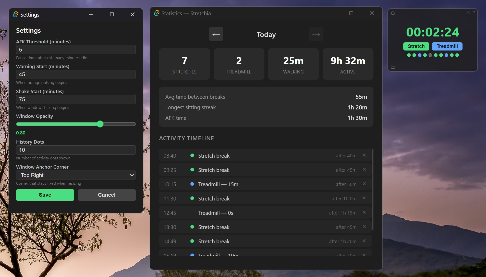

<p align="center">
  
</p>

<p align="center">
  A tiny always-on-top desktop widget that nags you to stretch.<br>
  Starts polite, gets increasingly aggressive.
</p>

<p align="center">
  
  
  
  
</p>

<p align="center">
  
</p>

## How It Works

A small floating timer sits in the corner of your screen, counting how long you've been sitting. The longer you go without a break, the more annoying it gets:

| Stage | Time | What Happens |
|-------|------|-------------|
| **Green** | 0 – 45 min | Chill. Just a timer. |
| **Yellow** | 45 – 60 min | Color shifts. Gentle nudge. |
| **Orange** | 60 – 68 min | Starts pulsing. You should really stretch. |
| **Red** | 68 – 75 min | Pulsing harder. Skip button appears. |
| **Critical** | 75+ min | Window shakes every 5 min. Background turns red. You asked for this. |

Hit **Stretch** to reset the timer and log a break. Hit **Treadmill** to start a walking session timer. Or try to hit **Skip** — good luck with that.

## The Skip Button

The Skip button only appears when things are already bad (red/critical stage). If you click it, you get a 3-stage guilt trip:

1. *"Your skeleton trusted you. Skip anyway?"*
2. *"Your spine just filed a formal complaint. Still sure?"*
3. *"In 20 years you'll be shaped like a question mark. Final answer?"*

The final stage makes you wait 10 seconds before the Yes button unlocks. Skips are recorded in your history as gray dots of shame.

## Features

- **Compact mode** — Click the corner anchor to shrink the window to a tiny `80x28` pill showing just the time
- **Anchor corner** — Choose which screen corner the window pins to (top-right by default). The window resizes toward that corner
- **AFK detection** — Timer pauses automatically when you step away (Windows via Win32 API, macOS via `ioreg`)
- **Tray icon** — Color-coded circle in the system tray matches the current stage. Right-click for quick actions
- **Activity history** — Colored dots show your day's activity at a glance: green (stretch), blue (treadmill), gray (skip), red (sat too long before a break)
- **Statistics** — Daily breakdown with stretch count, treadmill time, active time, longest sitting streak, and a full timeline
- **Persistent position** — Window remembers where you left it
- **Close to tray** — Closing hides the window; it keeps running in the background
- **Frameless & transparent** — Minimal, draggable, always-on-top

## Settings

All configurable from the settings window (gear icon):

- **AFK threshold** — minutes of inactivity before timer pauses (default: 5)
- **Warning start** — when orange pulsing begins (default: 45 min)
- **Shake start** — when shaking begins (default: 75 min)
- **Window opacity** — 0.3 to 1.0
- **History dots** — how many activity dots to show (3–20)
- **Anchor corner** — which corner the window sticks to

## Building

### Prerequisites

- [Node.js](https://nodejs.org/) (v18+)
- [Rust](https://rustup.rs/) (stable)
- Platform-specific build tools:
  - **Windows:** Visual Studio Build Tools with C++ workload
  - **macOS:** Xcode Command Line Tools

### Development

```bash
npm install
npm run tauri dev
```

### Production Build

```bash
npm run tauri build
```

The binary will be in `src-tauri/target/release/`.

## Tech Stack

- **Frontend:** HTML, CSS, TypeScript (Vite)
- **Backend:** Rust (Tauri 2)
- **Database:** SQLite (rusqlite, bundled)
- **AFK detection:** Win32 `GetLastInputInfo` / macOS `ioreg`
- **Tray icon:** Dynamic 16x16 RGBA rendered in Rust

## Project Structure

```
src/                        Frontend
  index.html / main.ts      Main window
  settings.html / .ts       Settings window
  stats.html / .ts          Statistics window
  *.css                      Styles & animations

src-tauri/src/              Rust backend
  lib.rs                     Tauri commands, tick loop, state
  timer.rs                   Timer logic & stage calculation
  afk.rs                     Platform-specific idle detection
  tray.rs                    System tray icon & menu
  db.rs                      SQLite schema & queries
```

## License

MIT
